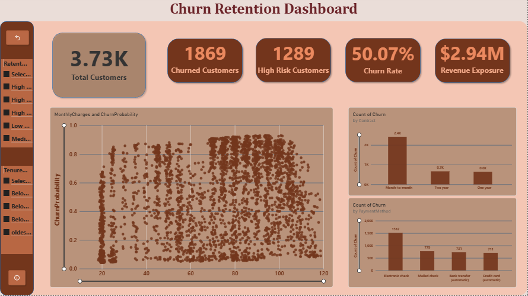
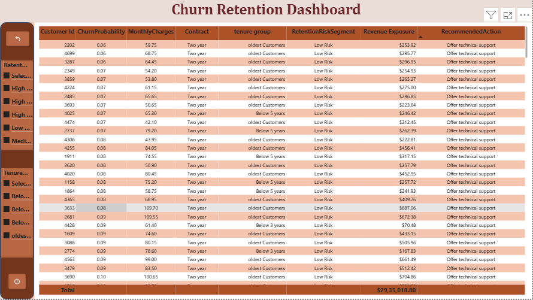

# Customer Churn Prediction & Retention Analytics

## Table of Contents

1. [Project Overview](#1-project-overview)
2. [Problem Statement / Motivation](#2-problem-statement--motivation)
3. [Dataset Description](#3-dataset-description)
4. [Goals & Objectives](#4-goals--objectives)
5. [Technologies Used](#5-technologies-used)
6. [Installation & Setup](#6-installation--setup)
7. [Project Structure](#7-project-structure)
8. [Methodology](#8-methodology)

   * [Data Loading & Initial Exploration](#data-loading--initial-exploration)
   * [Data Preprocessing](#data-preprocessing)
   * [Exploratory Data Analysis (EDA)](#exploratory-data-analysis-eda)
   * [Feature Engineering](#feature-engineering)
   * [Model Selection & Training](#model-selection--training)
   * [Model Evaluation](#model-evaluation)
   * [Cross-Validation](#cross-validation)
   * [Hyperparameter Tuning](#hyperparameter-tuning)
   * [Churn Threshold Analysis](#churn-threshold-analysis)
   * [Customer Risk Scoring](#customer-risk-scoring)
   * [Revenue Exposure Estimation](#revenue-exposure-estimation)
   * [Retention Segmentation](#retention-segmentation)
   * [Recommended Retention Actions](#recommended-retention-actions)
9. [Results & Discussion](#9-results--discussion)
10. [Power BI Dashboard](#power-bi-dashboard)
11. [Business Insights & Retention Strategy](#11-business-insights--retention-strategy)
12. [Conclusion & Future Work](#12-conclusion--future-work)
13. [Contributing](#13-contributing)
14. [License](#14-license)

---

## 1. Project Overview

This project focuses on developing an end-to-end machine learning solution for predicting customer churn in a telecommunications company.

The project uses historical customer data to understand churn behavior, identify important churn drivers, estimate the probability of individual customers churning, and convert those predictions into actionable customer risk and retention segments.

The workflow covers:

* Exploratory Data Analysis
* Data preprocessing
* Feature engineering
* Logistic Regression as a baseline model
* XGBoost classification
* Model evaluation using multiple classification metrics
* Cross-validation
* Hyperparameter tuning
* Churn probability and threshold analysis
* Customer risk scoring
* Revenue exposure estimation
* Retention segmentation
* Recommended retention actions

The overall objective is to move beyond simply predicting churn and provide a foundation for **proactive customer retention**.

---

## 2. Problem Statement / Motivation

Customer churn is a significant challenge for telecommunications companies. When customers discontinue their services, businesses lose recurring revenue and may need to spend additional resources acquiring replacement customers.

A reactive approach only addresses churn after a customer has already decided to leave. A predictive approach can help identify customers who may be at risk earlier and allow businesses to take appropriate retention actions.

This project addresses the problem by using customer demographics, service usage, contract information, tenure, billing information, and other account characteristics to predict the likelihood of customer churn.

The project also extends the prediction process by assigning customers to different risk categories and recommending potential retention actions.

### Business Questions

The project attempts to answer questions such as:

* Which customer characteristics are associated with higher churn?
* Which contract types have higher churn risk?
* How does customer tenure relate to churn?
* Do service subscriptions such as Online Security and Tech Support relate to churn?
* How well can machine learning predict customer churn?
* What probability threshold should be considered when identifying customers as churn risks?
* Which customers should receive greater retention attention?
* What potential monthly revenue exposure is associated with high churn probability?

---

## 3. Dataset Description

The dataset contains **3,738 customer records** from a telecommunications provider.

The dataset includes customer demographics, service information, account details, and the target variable `Churn`.

### Customer Demographics

* `gender`
* `SeniorCitizen`
* `Partner`
* `Dependents`

### Service Information

* `PhoneService`
* `MultipleLines`
* `InternetService`
* `OnlineSecurity`
* `OnlineBackup`
* `DeviceProtection`
* `TechSupport`
* `StreamingTV`
* `StreamingMovies`

### Account Information

* `tenure`
* `Contract`
* `PaperlessBilling`
* `PaymentMethod`
* `MonthlyCharges`
* `TotalCharges`

### Target Variable

* `Churn` — indicates whether a customer churned:

  * `Yes`
  * `No`

### Dataset Statistics

* **Initial Records:** 3,738
* **Initial Features:** 21
* **Missing `TotalCharges` Records:** 5
* **Final Records After Cleaning:** 3,733
* **Target:** `Churn`

---

## 4. Goals & Objectives

The primary objectives of this project are:

* Explore customer behavior and identify churn patterns.
* Clean and preprocess the customer dataset.
* Engineer additional features related to service usage and tenure.
* Build a baseline Logistic Regression model.
* Build an XGBoost classification model for churn prediction.
* Evaluate model performance using Accuracy, Precision, Recall, F1-Score, and ROC-AUC.
* Validate model performance using stratified cross-validation.
* Tune XGBoost hyperparameters using RandomizedSearchCV.
* Analyze different churn probability thresholds.
* Generate churn probabilities for individual customers.
* Categorize customers into Low, Medium, and High Risk groups.
* Estimate potential revenue exposure using churn probability and monthly charges.
* Segment high-risk customers for retention purposes.
* Generate recommended retention actions based on customer characteristics.

---

## 5. Technologies Used

The project uses the following technologies and libraries:

* **Python** — Primary programming language
* **Pandas** — Data manipulation and analysis
* **NumPy** — Numerical operations
* **Matplotlib** — Data visualization
* **Seaborn** — Statistical visualization
* **Scikit-learn** — Preprocessing, Logistic Regression, model evaluation, cross-validation, and hyperparameter tuning
* **XGBoost** — Gradient boosting classification model
* **Jupyter Notebook** — Development and analysis environment
* **Joblib** — Saving and loading the trained model

---

## 6. Installation & Setup

### 1. Clone the repository

```bash
git clone https://github.com/tamaxhh/Customer-Churn-Prediction.git
cd Customer-Churn-Prediction
```

### 2. Create a virtual environment

```bash
python -m venv venv
```

### Windows

```bash
.\venv\Scripts\activate
```

### macOS/Linux

```bash
source venv/bin/activate
```

### 3. Install required libraries

```bash
pip install pandas numpy matplotlib seaborn scikit-learn xgboost joblib openpyxl jupyter
```

### 4. Launch Jupyter Notebook

```bash
jupyter notebook
```

### 5. Open the notebook

Open:

```text
Customer Churn Prediction.ipynb
```

---

## 7. Project Structure

The repository contains the following key files:

```text
Customer-Churn-Prediction/
│
├── Customer Churn Prediction.ipynb
├── README.md
├── requirements.txt
│
├── data/
│   ├── raw/
│   └── processed/
│
├── models/
│   └── churn_model.pkl
│
└── LICENSE
```

### Main Files

* `Customer Churn Prediction.ipynb` — Main notebook containing data analysis, preprocessing, feature engineering, model development, evaluation, threshold analysis, and retention analytics.
* `README.md` — Project documentation.
* `requirements.txt` — Required Python libraries.
* `data/` — Dataset and processed customer risk data.
* `models/churn_model.pkl` — Saved trained model.

---

# 8. Methodology

The project follows an end-to-end customer churn prediction and retention analytics workflow.

## Data Loading & Initial Exploration

The dataset is loaded using Pandas and initially examined to understand:

* Dataset dimensions
* Column names
* Data types
* Missing values
* Duplicate records
* Unique values
* Churn distribution

The initial dataset contains **3,738 customer records and 21 features**.

---

## Data Preprocessing

### Missing Value Handling

The `TotalCharges` column contained 5 missing values.

These records were removed because the missing values represented incomplete customer account information.

After cleaning, the dataset contained:

**3,733 customer records.**

### Target Encoding

The `Churn` variable was converted into a binary target:

```python
No  → 0
Yes → 1
```

### Feature Preparation

The dataset was separated into:

* Numerical features
* Categorical features

Categorical features were handled using One-Hot Encoding, while numerical features were standardized using `StandardScaler`.

A `ColumnTransformer` was used to apply the appropriate preprocessing to each feature type.

---

## Exploratory Data Analysis (EDA)

EDA was performed to understand customer behavior and identify potential churn drivers.

The analysis examined relationships between churn and:

* Contract type
* Customer tenure
* Monthly charges
* Customer demographics
* Internet service
* Online Security
* Tech Support
* Payment method
* Other subscribed services

### Key EDA Insights

* Customers with lower tenure showed higher churn.
* Month-to-month contract customers showed higher churn compared with customers on longer-term contracts.
* Customers without services such as Online Security and Tech Support showed higher churn.
* Fiber optic internet users showed relatively higher churn.
* Higher monthly charges were associated with increased churn.
* Electronic Check customers showed higher churn.
* Senior citizens and customers without partners or dependents showed higher churn.
* Gender did not appear to be a major differentiating factor in the analysis.

---

## Feature Engineering

Additional features were created to provide the model with more useful information.

### Service Flags

Binary flags were created for service-related columns.

For example:

```text
OnlineSecurity → OnlineSecurity_flag
TechSupport → TechSupport_flag
```

These flags were then combined to create:

### `ServiceCount`

`ServiceCount` represents the number of subscribed services for each customer.

### Tenure Group

Customers were grouped into tenure categories:

* Below 1 year
* Below 3 years
* Below 5 years
* Oldest Customers

### Average Monthly Value

An additional feature called `AvgMonthlyValue` was created using:

```text
TotalCharges / Tenure
```

This provides an approximate average monthly customer value based on the available billing information.

### Tenure Feature Selection

The original `tenure` feature was later removed from the modeling dataset because a tenure group feature had already been created and the original feature showed high correlation in the feature analysis.

---

## Model Selection & Training

Two main classification approaches were used.

### 1. Logistic Regression

Logistic Regression was developed as a baseline classification model.

The model used:

* Standardized numerical features
* One-Hot Encoded categorical features
* `class_weight="balanced"`

This provided a baseline against which the XGBoost model could be evaluated.

### 2. XGBoost

XGBoost was used as the primary tree-based classification model.

The initial model used parameters including:

```text
n_estimators = 300
max_depth = 4
learning_rate = 0.05
subsample = 0.8
colsample_bytree = 0.8
```

The model was trained using the preprocessed customer data.

---

## Model Evaluation

The models were evaluated using:

* Accuracy
* Precision
* Recall
* F1-Score
* ROC-AUC
* Confusion Matrix
* Classification Report

These metrics provide a more complete view of model performance than accuracy alone.

### XGBoost Test Performance

The evaluated XGBoost model achieved:

* **Accuracy:** 78.05%
* **Precision:** 76.92%
* **Recall:** 80.21%
* **F1-Score:** 78.53%
* **ROC-AUC:** 85.91%

For the churn class specifically:

* **Precision:** 0.77
* **Recall:** 0.80
* **F1-Score:** 0.79

The relatively high recall for the churn class is useful for a retention-focused application because it indicates that the model identifies a substantial proportion of customers who actually churned.

---

## Cross-Validation

Stratified 5-fold cross-validation was used to evaluate the consistency of the XGBoost model.

The ROC-AUC scores across the five folds were:

```text
0.8481
0.8484
0.8546
0.8176
0.8673
```

### Mean Cross-Validation ROC-AUC

```text
0.8472
```

This provides an additional indication of model performance across different subsets of the dataset.

---

## Hyperparameter Tuning

`RandomizedSearchCV` was used to search for better XGBoost hyperparameters.

The search considered:

* Number of estimators
* Maximum tree depth
* Learning rate
* Subsampling
* Column sampling

The best parameter combination identified in the notebook was:

```text
subsample = 0.7
n_estimators = 300
max_depth = 4
learning_rate = 0.01
colsample_bytree = 1.0
```

The resulting estimator was stored as:

```python
best_model
```

---

## Churn Threshold Analysis

Instead of automatically treating `0.50` as the only classification threshold, the project analyzes different probability thresholds.

The XGBoost model generates a churn probability for each customer.

For example:

```text
Customer A → 0.82
Customer B → 0.67
Customer C → 0.43
Customer D → 0.21
```

A threshold converts these probabilities into churn predictions.

The project evaluates:

```text
0.30
0.40
0.50
0.60
0.70
```

For each threshold, the following metrics are calculated:

* Number of customers flagged
* Percentage of customers flagged
* Precision
* Recall
* F1-Score

This allows the churn classification cutoff to be considered from both a machine learning and business perspective.

### Threshold Analysis Results

The notebook produced the following results on the test set:

| Threshold | Customers Flagged | Flagged % | Precision | Recall |     F1 |
| --------: | ----------------: | --------: | --------: | -----: | -----: |
|      0.30 |               477 |    63.86% |    71.07% | 90.64% | 79.67% |
|      0.40 |               433 |    57.97% |    74.13% | 85.83% | 79.55% |
|      0.50 |               390 |    52.21% |    76.92% | 80.21% | 78.53% |
|      0.60 |               337 |    45.11% |    80.71% | 72.73% | 76.51% |
|      0.70 |               286 |    38.29% |    83.22% | 63.64% | 72.12% |

The analysis demonstrates the trade-off between identifying more potential churners and reducing the number of customers flagged for intervention.

---

## Customer Risk Scoring

The trained model was used to generate churn probabilities for the customer dataset.

A new column was created:

```text
ChurnProbability
```

Customers were then classified into three risk categories:

```text
Probability >= 0.70 → High Risk
Probability >= 0.40 → Medium Risk
Probability < 0.40  → Low Risk
```

This converts the model output into a format that can be used for customer retention analysis.

---

## Revenue Exposure Estimation

A revenue exposure proxy was created using:

```text
RevenueAtRisk =
MonthlyCharges × ChurnProbability
```

This is intended as a **probability-weighted revenue exposure indicator**, not an actual prediction of future revenue loss.

It can help prioritize customers who combine:

* Higher monthly charges
* Higher probability of churn

---

## Retention Segmentation

Customers were further segmented using churn probability, monthly charges, and tenure.

The project identifies segments such as:

* **High Risk - High Value**
* **High Risk - New Customer**
* **High Risk - General**
* **Medium Risk**
* **Low Risk**

This provides a bridge between machine learning predictions and potential business retention activities.

---

## Recommended Retention Actions

Based on the customer's risk segment and service characteristics, the project generates recommended actions.

Examples include:

| Customer Situation       | Recommended Action         |
| ------------------------ | -------------------------- |
| High Risk + High Value   | Priority retention offer   |
| High Risk + New Customer | Onboarding intervention    |
| No Online Security       | Promote security service   |
| No Tech Support          | Offer technical support    |
| Month-to-month contract  | Promote long-term contract |
| Other customers          | Standard engagement        |

The purpose of this layer is to transform a churn prediction into a potential retention workflow.

---

# 9. Results & Discussion

The project demonstrates that machine learning can be used to identify customers who are more likely to churn.

The XGBoost model achieved approximately:

* **78% Accuracy**
* **77% Precision**
* **80% Recall**
* **79% F1-Score**
* **86% ROC-AUC**

The model's churn recall of approximately **80%** indicates that it identified a substantial proportion of actual churners in the test set.

The threshold analysis also demonstrates that the classification threshold has a meaningful effect on the number of customers identified as potential churners.

For example:

* A threshold of **0.30** flags more customers and achieves higher recall.
* A threshold of **0.70** flags fewer customers and achieves higher precision.
* A threshold of **0.50** represents the conventional probability cutoff and provides a middle ground in this analysis.

The project therefore treats churn prediction as more than a simple binary classification problem and introduces a customer-risk perspective for retention planning.

---

# Power BI Dashboard

The interactive Power BI dashboard presents customer churn, risk segments, revenue exposure, and retention insights.

[Open the Power BI dashboard file](Power_BI/Churn%20Retention%20Dashboard.pbix)





---

# 11. Business Insights & Retention Strategy

The analysis highlights several customer groups that deserve attention from a retention perspective.

### Month-to-Month Customers

Customers with month-to-month contracts demonstrate higher churn levels.

**Potential action:** Encourage suitable customers to move toward longer-term contracts through appropriate offers or incentives.

### New Customers

Customers with lower tenure show higher churn risk.

**Potential action:** Strengthen onboarding, early engagement, and customer support during the initial period.

### Online Security & Tech Support

Customers without value-added services such as Online Security and Tech Support show higher churn.

**Potential action:** Promote relevant service bundles and communicate their benefits.

### High Monthly Charges

Customers with higher monthly charges show increased churn in the analysis.

**Potential action:** Investigate pricing perception, service value, and suitable retention offers.

### High-Risk Customers

Customers with high predicted churn probability can be prioritized based on their risk level and potential revenue exposure.

The combination of:

```text
Churn Probability
        +
Customer Value
        +
Customer Characteristics
        ↓
Retention Segment
        ↓
Recommended Action
```

provides a more business-oriented approach than using churn prediction alone.

---

# 12. Conclusion & Future Work

This project developed a machine learning-based customer churn prediction and retention analytics workflow using telecom customer data.

The project progressed from:

```text
Raw Customer Data
        ↓
Data Cleaning
        ↓
EDA
        ↓
Feature Engineering
        ↓
Logistic Regression Baseline
        ↓
XGBoost
        ↓
Model Evaluation
        ↓
Cross-Validation
        ↓
Hyperparameter Tuning
        ↓
Churn Probability
        ↓
Threshold Analysis
        ↓
Customer Risk Scoring
        ↓
Revenue Exposure
        ↓
Retention Segmentation
        ↓
Recommended Actions
```

The final workflow provides both predictive and business-oriented insights that can support proactive customer retention.

### Future Enhancements

Potential future improvements include:

* Integrating SQL for customer-level business analysis.
* Building an interactive Power BI dashboard.
* Adding SHAP-based model explainability.
* Improving retention segmentation using customer lifetime value.
* Testing additional machine learning models.
* Optimizing the churn threshold using a formal business cost framework.
* Deploying the model through a Streamlit application or API.
* Creating automated prediction pipelines for new customer data.
* Monitoring model performance over time.

---

# 13. Contributing

Contributions are welcome.

If you have suggestions for improvements, new features, additional analysis, or bug fixes, feel free to open an issue or submit a pull request.

---

# 14. License

This project is licensed under the MIT License. See the `LICENSE` file for details.
